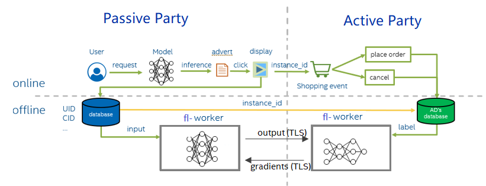
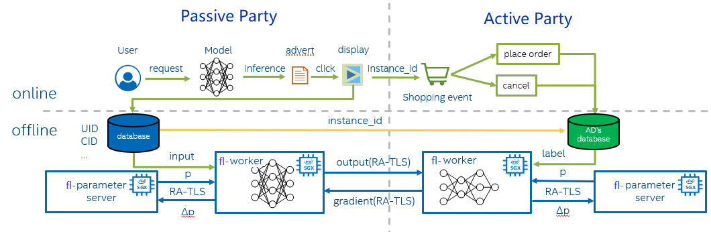

# Vertical Federated Learning

## Background

With the increasing concerns on data security and user privacy in machine learning, federated learning becomes a promising solution to privacy and security challenges.  Federated Learning can be classified into Vertical Federated Learning, Horizontal Federated Learning, Federated Transfer Learning (FTL) according to  how sensitive data are distributed among participating parties. 

Federated Learning usually adopts three major technologies in protecting privacy: Differential Privacy (DP), Homomorphic Encryption (HE) and Private Set Intersection (PSI). This solution presents an innovative way to presents an secure enhanced Vertical Federated Learning  by integrating Intel SGX technology.

Vertical Federated Learning assumes that the data are partitioned by different features (including labels). A typical scenario of Vertical Federated Learning is including two parts: online reference and offline training. When an online media platform A displays ads of an ecommerce company B to its users and charges B for each conversion (e.g., user clicking the ad and buying the product). 



During offline training, e-commerce advertisers and the Data Management Platform (DMP), both parties use the example_id recorded online to align the data and label, and then read the data in the order of alignment. The model is divided into two parts. The DMP inputs the data into the first half, obtains the intermediate result (embedding) and then sends it to the e-commerce
advertisers. E-commerce advertisers calculate the second half of the model, then use the label they record to calculate the loss and gradient, and then pass the gradient back to the DMP. Finally, the e-commerce advertisers and DMP update their models.

## Introduction

In this solution, it focuses on online training part and the main involved modules are as below:

-  AI Framework – [Fedlearner](https://github.com/bytedance/fedlearner/tree/fix_dev_sgx), a Bytedance end-to-end open-source framework, based on TensorFlow, for machine learning, providing interfaces that facilitate federated learning tasks. 

- Security Isolation LibOS – [Gramine](https://github.com/gramineproject/gramine), an open-source project for Intel SGX, run applications in an isolated environment with no modification in Intel SGX. 
- Containerization using Docker - The framework of this solution is built in Docker and can be automating deployment, management of containerized with Kubernetes.
- Runtime Security - AI framework Fedlearner will run into Intel SGX Enclave, which offers hardware-based memory encryption that isolates specific application code and data in memory. 

- Model Protection - Protecting the confidentiality and integrity of the model by encryption when training takes place on an untrusted platform. 

- Data Protection - Establishing a secure communication link ([RA-TLS enhanced gRPC](https://cczoo.readthedocs.io/en/latest/Solutions/grpc-ra-tls/index.html)) from parameter server to worker and worker to worker. 

- Platform Integrity - Providing Remote Attestation mechanism when workers begins to communicate with each other during the handshake. Please refer to [RA-TLS enhanced gRPC](https://cczoo.readthedocs.io/en/latest/Solutions/grpc-ra-tls/index.html) for more details.




Usually, there are two roles during model training - parameter server and workers. Each worker computes the gradient of the loss on its portion of the data, and then a parameter server sums each worker’s gradient to yield the full mini-batch gradient. After using this gradient to update the model parameters, the parameter server must send back the updated weights to the worker.  Workers from DMP and e-commerce advertisers will transfer labels and gradients via gRPC.

**Runtime security with Intel SGX**

Intel SGX allows user-level code to allocate private regions of memory, called Enclaves, which are designed to be protected from processes running at higher privilege levels. It also helps protect against SW attacks even if OS/drivers/BIOS/VMM/SMM are compromised and helps increase protections for secrets even when attacker has full control of platform. In this solution, parameter server and worker are both running SGX Enclave smoothly with the help of LibOS Gramine. 

**Attestation and Authentication**

In this solution, when two workers build the connection via gRPC, before the communication channel establish successfully, the workers will verify each other with two parts: remote attestation and identity authentication.

In remote attestation, generally the attesting SGX enclave collects attestation evidence in the form of an SGX Quote using the Quoting Enclave. This form of attestation is used to gain the remote partner's trust by sending the attestation evidence to a remote party (not on the same physical machine).

When workers begin the communication via gRPC, the SGX Quote will be integrated in TLS and verified in the other worker side by the preinstalled Intel SGX DCAP package in the container. 

Besides the verification of the Enclave, it also checks the identity information (`mr_enclave`,`mr_signer`,`isv_prod_id`,`isv_svn`) of the Enclave which excludes the possibility of authenticating them via a user identity.

Once the verification and identity check pass, the communication channel between workers will be built successfully. More details please refer to [RA-TLS enhanced gRPC](https://cczoo.readthedocs.io/en/latest/Solutions/grpc-ra-tls/index.html). 

**Data at-rest security**

We encrypt models with cryptographic (wrap) key by using Protected-File mode in LibOS Gramine to guarantee the integrity of the model file by metadata checking method. Any changes of the model will have a different hash code, which will be denied by Gramine .


## Prerequisites

- Ubuntu 18.04. This solution should work on other Linux distributions as well, but for simplicity we provide the steps for Ubuntu 18.04 only.

- Docker Engine. Docker Engine is an open source containerization technology for building and containerizing your applications. In this solution, Gramine, Fedlearner, gRPC will be built in Docker images. Please follow [this guide](https://docs.docker.com/engine/install/ubuntu/#install-using-the-convenience-script) to install Docker engine.

- SGX capable platform. Intel SGX Driver and SDK/PSW. You need a machine that supports Intel SGX and FLC/DCAP. Please follow [this guide](https://download.01.org/intel-sgx/latest/linux-latest/docs/) to install the Intel SGX driver and SDK/PSW. One way to verify SGX enabling status in your machine is to run [QuoteGeneration](https://github.com/intel/SGXDataCenterAttestationPrimitives/blob/master/QuoteGeneration) and [QuoteVerification](https://github.com/intel/SGXDataCenterAttestationPrimitives/blob/master/QuoteVerification) successfully.

Here, we will demonstrate how to run leader and follower from two containers.


## Executing Fedlearner in SGX

### 1. Download source code

```
git clone -b fix_dev_sgx https://github.com/bytedance/fedlearner.git
cd fedlearner
git submodule init
git submodule update
```

### 2. Build Docker image                                    

```
img_tag=Your_defined_tag
./sgx/build_dev_docker_image.sh ${img_tag}   
```

*Note:* `build_dev_docker_image.sh` provides parameter `proxy_server` to help you set your network proxy. It can be removed from this script if it is not needed.

You will get the built image:

```
REPOSITORY             TAG         IMAGE ID            CREATED           SIZE
fedlearner-sgx-dev     latest      8c3c7a05f973        45 hours ago      15.2GB
```

### 3. Start Container

In terminal 1, start container to run leader:

```
docker run -it \
    --name=fedlearner_leader \
    --restart=unless-stopped \
    -p 50051:50051 \
    --device=/dev/sgx_enclave:/dev/sgx/enclave \
    --device=/dev/sgx_provision:/dev/sgx/provision \
    fedlearner-sgx-dev:latest  \
    bash
```

In terminal 2, start container to run follower:

```
docker run -it \
    --name=fedlearner_follwer \
    --restart=unless-stopped \
    -p 50052:50052 \
    --device=/dev/sgx_enclave:/dev/sgx/enclave \
    --device=/dev/sgx_provision:/dev/sgx/provision \
    fedlearner-sgx-dev:latest  \
    bash
```

#### 3.1 Configure PCCS

- If you are using public cloud instance, please replace the pccs url in `/etc/sgx_default_qcnl.conf` with the new pccs url provided by the cloud.

  ```
  Old: PCCS_URL=https://pccs.service.com:8081/sgx/certification/v3/ 
  New: PCCS_URL=https://public_cloud_pccs_url
  ```

- If you are using your own machine, please make sure, the PCCS service is running successfully in your host with command `systemctl status pccs`. And add your host IP address in `/etc/hosts` under container. For example:

  ```
  cat /etc/hosts
  XXX.XXX.XXX.XXX pccs.service.com   #XXX.XXX.XXX.XXX is the host IP
  ```

#### 3.2 Start aesm service

Execute below script in both leader and follower container:

```
/root/start_aesm_service.sh
```

#### 4. Prepare data

Generate data in both leader and follower container:

```
cd /gramine/CI-Examples/wide_n_deep
./test-ps-sgx.sh data
```

#### 5. Compile applications

Compile applications in both leader and follower container:

```
cd /gramine/CI-Examples/wide_n_deep
./test-ps-sgx.sh make
```

Please find `mr_enclave`,`mr_signer` from the print log as below:

```
+ make
+ grep 'mr_enclave\|mr_signer\|isv_prod_id\|isv_svn'
    isv_prod_id: 0
    isv_svn:     0
    mr_enclave:  bda462c6483a15f18c92bbfd0acbb61b9702344202fcc6ceed194af00a00fc02
    mr_signer:   dbf7a340bbed6c18345c6d202723364765d261fdb04e960deb4ca894d4274839
    isv_prod_id: 0
    isv_svn:     0
```

Then, update the leader's `dynamic_config.json` under current folder with follower's  `mr_enclave`,`mr_signer`. Also, update follower's  `dynamic_config.json` with leader's `mr_enclave`,`mr_signer`.

```
dynamic_config.json:
{
......
  "sgx_mrs": [
    {
      "mr_enclave": "",
      "mr_signer": "",
      "isv_prod_id": "0",
      "isv_svn": "0"
    }
  ],
......
}

```

#### 6. Config leader and follower's IP

In leader's  `test-ps-sgx.sh`, for `--peer-addr` , please replace `localhost` with `follower_contianer_ip`

```
elif [ "$ROLE" == "leader" ]; then
    make_custom_env
    rm -rf model/leader
    ......
    taskset -c 4-7 stdbuf -o0 gramine-sgx python -u leader.py \
    --local-addr=localhost:50051   \
    --peer-addr=follower_contianer_ip:50052 
```

In follower's `test-ps-sgx.sh`, for `--peer-addr` , please replace `localhost` with `leader_contianer_ip`

```
elif [ "$ROLE" == "follower" ]; then
    make_custom_env
    rm -rf model/follower
    ......
    taskset -c 12-15 stdbuf -o0 gramine-sgx python -u follower.py \
    --local-addr=localhost:50052   \
    --peer-addr=leader_container_ip:50051      
```

*Note:* Get the container ip under your host: 

```
docker inspect --format '{{ .NetworkSettings.IPAddress }}' contianer_id
```

#### 7.Run the distributing training

Under leader container:

```
cd /gramine/CI-Examples/wide_n_deep
./test-ps-sgx.sh leader
```

Under follower container:

```
cd /gramine/CI-Examples/wide_n_deep
./test-ps-sgx.sh follower
```

Finally, the model file will be placed at 

```
./model/leader/id/save_model.pd
```

```
./model/follower/id/save_model.pd
```

